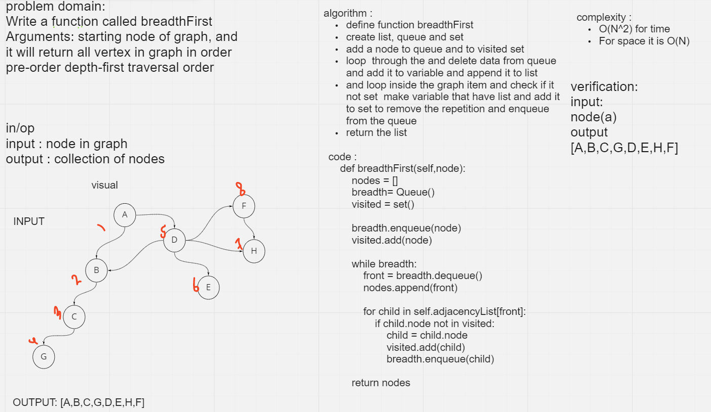

## Challenge
<!-- Description of the challenge -->
Write a function called breadthFirst Arguments: starting node of graph, and it will return all vertex in graph in order pre-order depth-first traversal order
## Approach & Efficiency
<!-- What approach did you take? Why? What is the Big O space/time for this approach? -->
complexity :
- time : O(N^2) 
- space : O(N)
## Solution
<!-- Embedded whiteboard image -->

