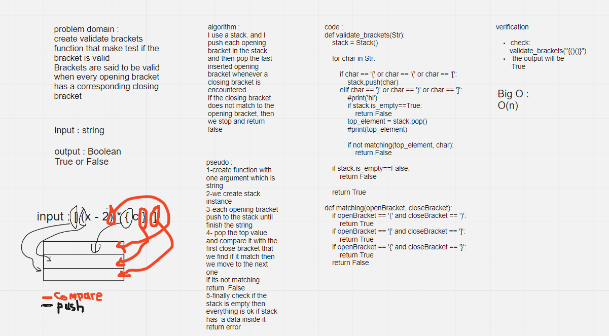

# Challenge Summary
<!-- Description of the challenge -->
validate brackets function that make test if the bracket is valid
Brackets are said to be valid when every opening bracket has a corresponding closing bracket
## Whiteboard Process

## Approach & Efficiency
<!-- What approach did you take? Why? What is the Big O space/time for this approach? -->
I use the stack and its method (push, pop and is_empty)

comlexity is : O(1)
## Solution
<!-- Show how to run your code, and examples of it in action -->

it will check if every bracket has it own close bracket it will return True else it will return False
ex :
`validate_brackets("{()()}")` 
  - the output will be `True`

