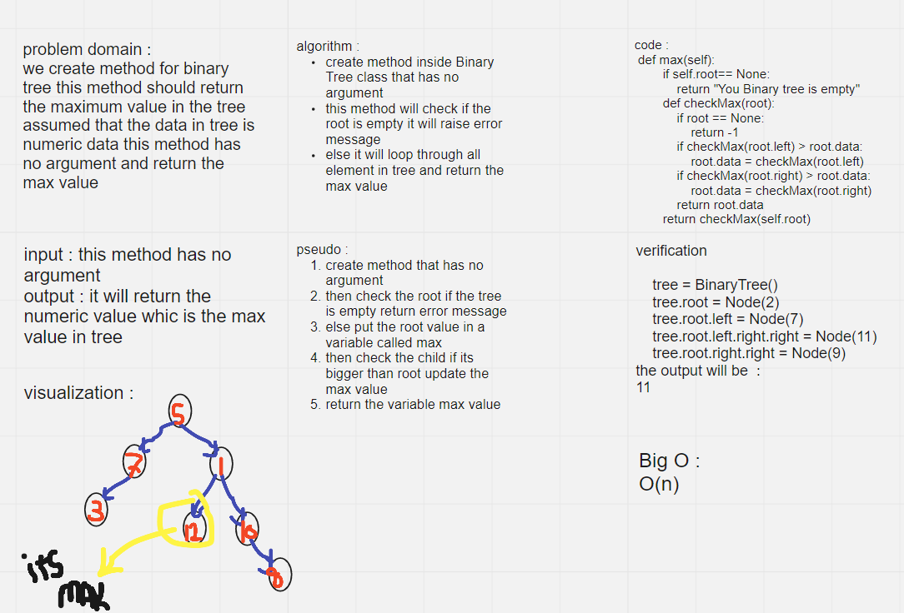

# Challenge Summary
we create method for binary tree this method should return the maximum value in the tree assumed that the data in tree is numaric data this method has no argument and return the max value


## Whiteboard Process
<!-- Embedded whiteboard image -->

## Approach & Efficiency
<!-- What approach did you take? Why? What is the Big O space/time for this approach? -->
it will closure loop through all element in tree and return max value
complexity is : O(n)
## Solution
<!-- Show how to run your code, and examples of it in action -->
```
if __name__ == '__main__':
    tree = BinaryTree()
    tree.root = Node(4)
    tree.root.left.right.left = Node(1)
    tree.root.left.right.right = Node(11)
    tree.root.right.right = Node(9)
    print("Maximum element is",tree.max())
```
the output will be:
`Maximum element is : 11`
