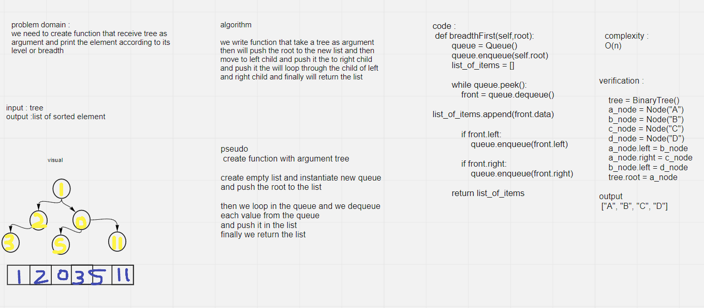

# Challenge Summary
we create function called breadth first thats recieve tree as argument and return list of all values in the tree, in the order they were encountered (according to its breadth(level))

## Whiteboard Process
<!-- Embedded whiteboard image -->

## Approach & Efficiency
loop ing through each element in tree
complexity : O(n)

## Solution
<!-- Show how to run your code, and examples of it in action -->
```
    tree = BinaryTree()
    tree.root = Node(2)
    tree.root.left = Node(7)
    tree.root.right = Node(5)
    tree.root.left.right = Node(6)
    tree.root.left.right.left = Node(1)
    tree.root.left.right.right = Node(11)
    tree.root.right.right = Node(9)
    tree.root.right.right.left = Node(4)
    print(tree.breadthFirst(tree.root))
```
    output should be :
    ` [2, 7, 5, 6, 9, 1, 11, 4] `