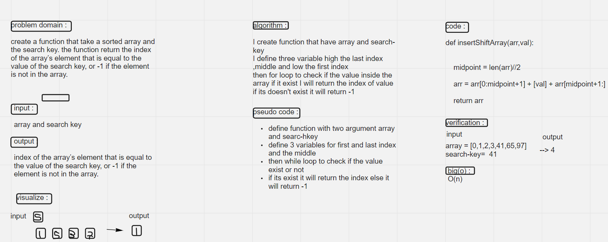

# Binary Search of Sorted Array
create a function that take a sorted array and the search key. the function return the index of the array’s element that is equal to the value of the search key, or -1 if the element is not in the array.
## Whiteboard Process

## Approach & Efficiency
<!-- What approach did you take? Discuss Why. What is the Big O space/time for this approach? -->
I used iterartion approach using while loop
Big(o) :
O(n)