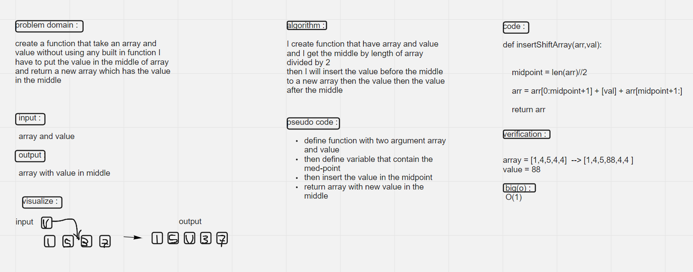

# array-insert-shift
I create a function that take an array and value without using any built in function I have to put the value in the middle of array and return a new array

## Whiteboard Process

## Approach & Efficiency
I defined a variable which take the middle value and I insert the  value after the midd 
BIG(o):
O(1)
