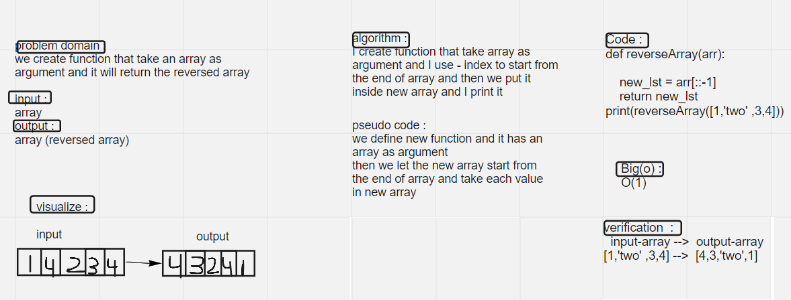

#  Array Reverse
 I create function that take arraya as argument and it will return same array but with reversed element

## white board

## Approach & Efficiency

I used the minus (-) index to let array start from the end to get the reverse array
the big(o) will be O(1)