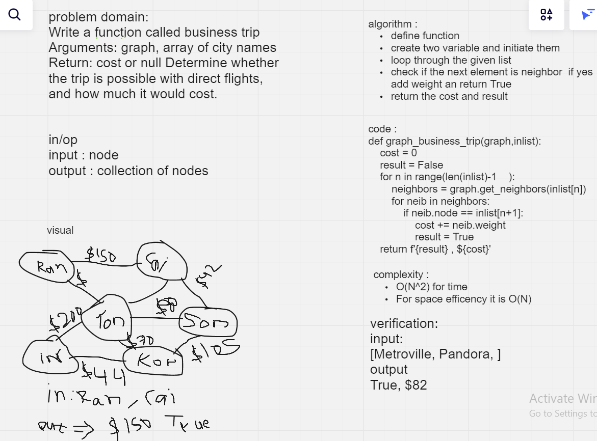

# Challenge Summary
Write a function called business trip Arguments: graph, array of city names Return: cost or null Determine whether the trip is possible with direct flights, and how much it would cost.

## Whiteboard Process
<!-- Embedded whiteboard image -->

## Approach & Efficiency
<!-- What approach did you take? Why? What is the Big O space/time for this approach? -->
complexity :
- O(N^2) for time
- For space efficency it is O(N)
## Solution
<!-- Show how to run your code, and examples of it in action -->
```
input:
[Metroville, Pandora, ]
output
True, $82
```