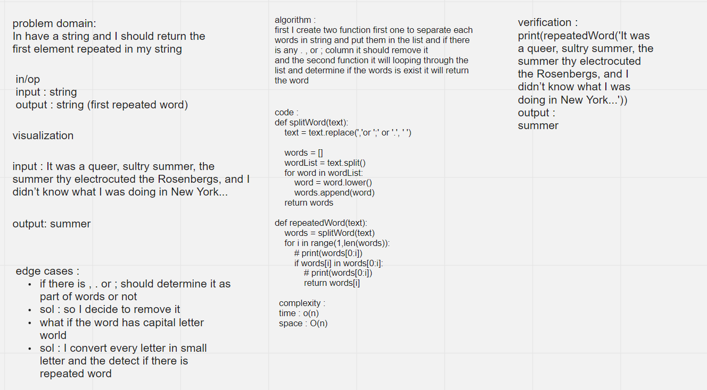

# Challenge Summary
we have string and I need to loop through this string to find the first word that had repeated

## Whiteboard Process

## Approach & Efficiency
<!-- What approach did you take? Why? What is the Big O space/time for this approach? -->
using iteration it take complexity :
- time : O(n)
- space : O(n)
## Solution
<!-- Show how to run your code, and examples of it in action -->

text = "It was a queer, sultry summer, the summer thy electrocuted the Rosenbergs, and I didn’t know what I was doing in New York..."
print(repeatedWord(text))

 - [x]