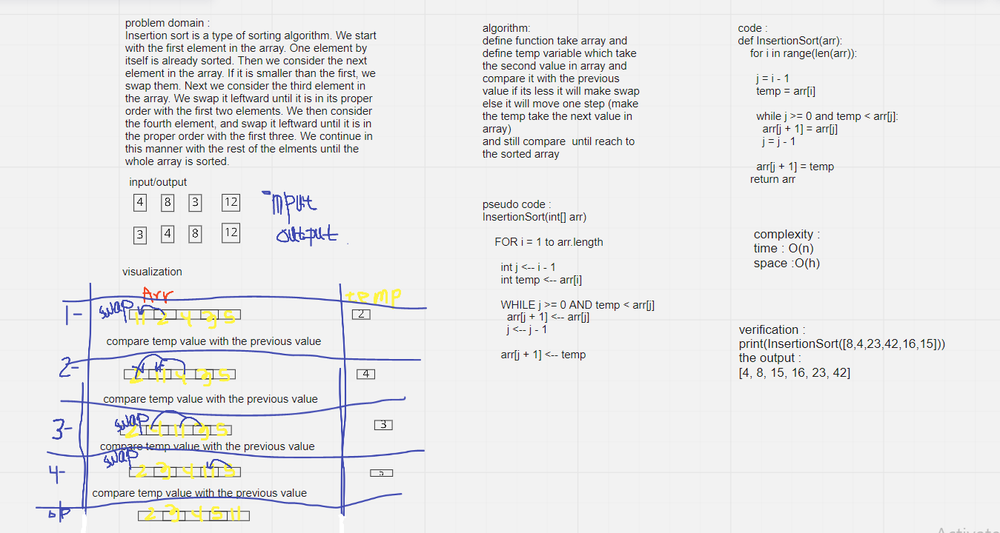

# Challenge Summary
<!-- Description of the challenge -->
Insertion sort is a simple sorting algorithm that builds the final sorted array (or list) one item at a time. It is much less efficient on large lists than more advanced algorithms such as quicksort, heapsort, or merge sort.
## Whiteboard Process
<!-- Embedded whiteboard image -->

## Approach & Efficiency
<!-- What approach did you take? Why? What is the Big O space/time for this approach? -->
using iteration method
- Space complexity Big O(1) 
- Time complexity Big O(n^2)>
## Solution
<!-- Show how to run your code, and examples of it in action -->
print(InsertionSort([8,4,23,42,16,15]))
output:
`[4, 8, 15, 16, 23, 42]`