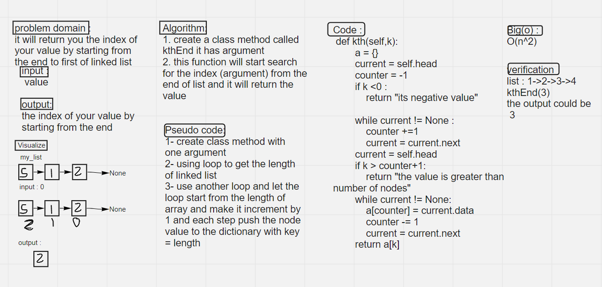

# Challenge Summary
<!-- Description of the challenge -->
Zip the two linked lists together into one so that the nodes alternate between the two lists and return a reference to the head of the zipped list.
## Whiteboard Process
<!-- Embedded whiteboard image -->

## Approach & Efficiency
<!-- What approach did you take? Why? What is the Big O space/time for this approach? -->
its using iteration (two loops) 
the complexity : O(n^2)
## Solution
<!-- Show how to run your code, and examples of it in action -->
my linked list :
head -> 5 -> 8 -> 77 -> 9
index : 3    2     1    0
when you call function wth argument =2 :
Kth(2)
the output will be
8
