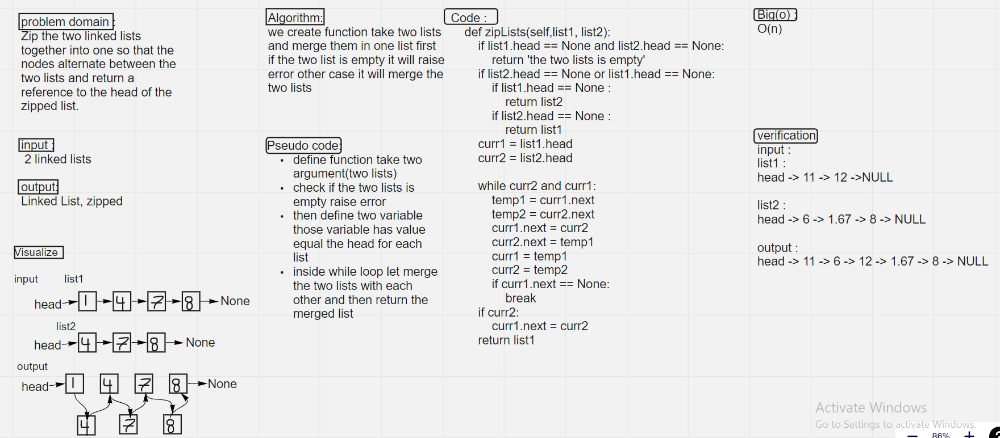

# Challenge Summary
<!-- Description of the challenge -->

create zipLists method that take two argument (list argument) and merge it together and return the merged list
## Whiteboard Process
<!-- Embedded whiteboard image -->

## Approach & Efficiency
<!-- What approach did you take? Why? What is the Big O space/time for this approach? -->
iteration approch (while loop)
complexity is :
O(n)
## Solution
<!-- Show how to run your code, and examples of it in action -->
zipLists(list1, list2)

input :
list1 :
head -> 11 -> 12 ->NULL

list2 :
head -> 6 -> 1.67 -> 8 -> NULL

output :
head -> 11 -> 6 -> 12 -> 1.67 -> 8 -> NULL