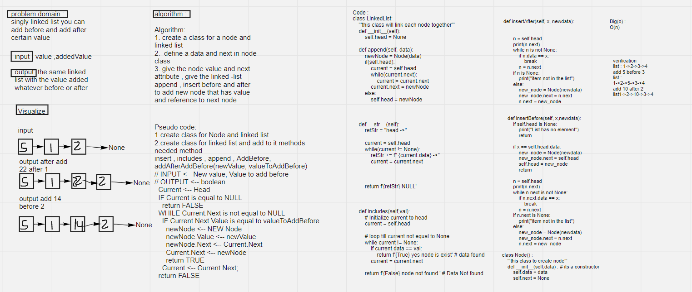

# Challenge Summary
<!-- Description of the challenge -->
singly linked list with methods

## Whiteboard Process
<!-- Embedded whiteboard image -->

## Approach & Efficiency
<!-- What approach did you take? Why? What is the Big O space/time for this approach? -->
it iteration approach it have O(n)
## Solution
<!-- Show how to run your code, and examples of it in action -->
this code have a multiple methods add at the end and add before and and append