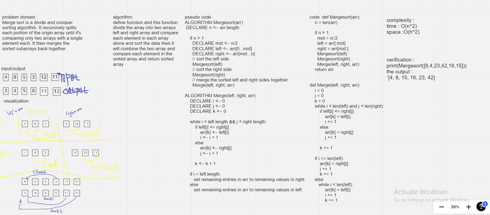

# Challenge Summary
divide and conquer sorting algorithm. It recursiveley splits each portion of the origin array until it's comparing only two arrays with a single element each. It then merges the sorted subarrays back together.

## Whiteboard Process
<!-- Embedded whiteboard image -->

## Approach & Efficiency
<!-- What approach did you take? Why? What is the Big O space/time for this approach? -->
split the list in half and itterate thorugh each half at the same time. create a variable for each half of the list and another to go thorugh th ewhole list (i .j , k) sort each half and when merging them back together merge one by one.
big o(n)
time : o(n^2)
space : o(h^2)
## Solution

`print(Mergesort([8,4,23,42,16,15]))`
the output :
`[4, 8, 15, 16, 23, 42]`

## pull request
[Pull Request](https://github.com/oqlaalrefai/data-structures-and-algorithms/pull/34)
