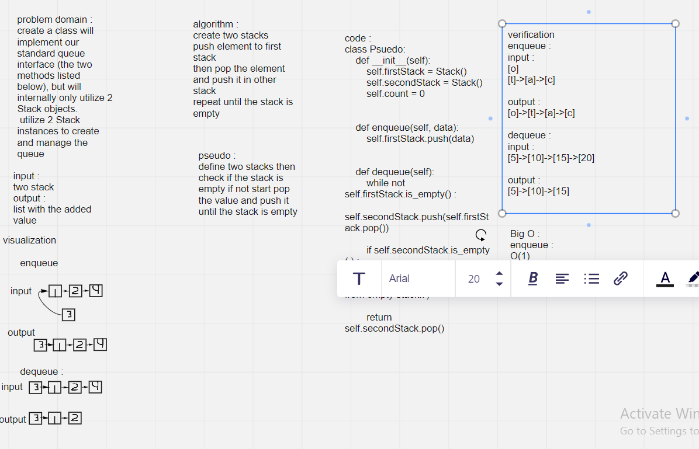

# Challenge Summary
Create a brand new PseudoQueue class. Do not use an existing Queue. Instead, this PseudoQueue class will implement our standard queue interface (the two methods listed below), but will internally only utilize 2 Stack objects. Ensure that you create your class with the following methods:

enqueue(value) which inserts value into the PseudoQueue, using a first-in, first-out approach. dequeue() which extracts a value from the PseudoQueue, using a first-in, first-out approach.

## Whiteboard Process

## Approach & Efficiency
using iteration technique
enqueue :
O(1)
dequeue:
O(n)

## Solution
using dequeue and enqueue methods
verification
enqueue :
input :
[o]
[t]->[a]->[c]

output :
[o]->[t]->[a]->[c]

dequeue :
input :
[5]->[10]->[15]->[20]

output :
[5]->[10]->[15]
